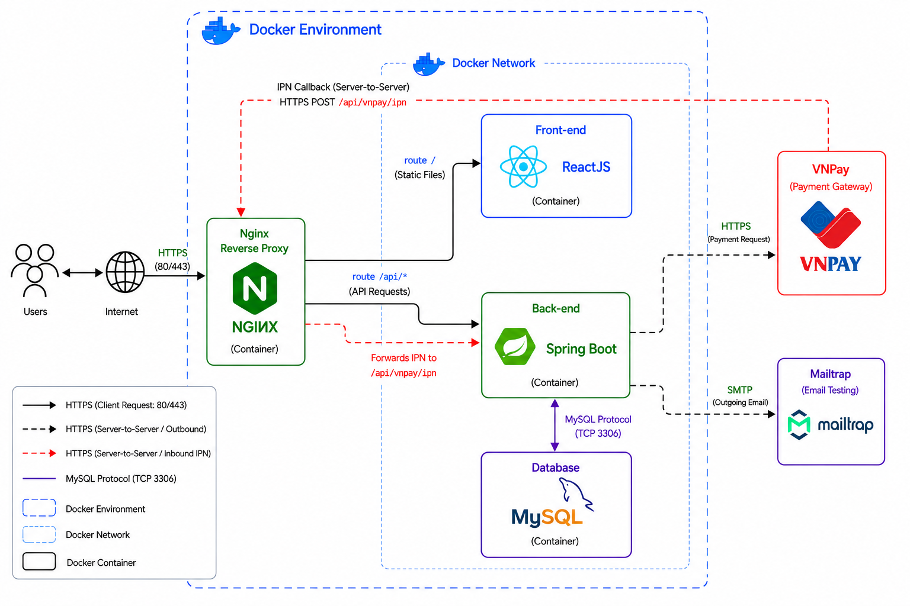

# E-Commerce Platform — Spring Boot + ReactJS + MySQL

Hệ thống thương mại điện tử full-stack với thanh toán online qua VNPay Sandbox (IPN), thông báo email bất đồng bộ qua Mailtrap, containerize toàn bộ bằng Docker Compose, và Nginx làm reverse proxy phía trước.

## 1. Tech stack

| Layer | Công nghệ |
| :--- | :--- |
| **Backend** | Java 21, Spring Boot 3.x (Web, Data JPA, Validation, Async), Hibernate |
| **Frontend** | ReactJS (Vite), HTML, CSS, Axios |
| **Database** | MySQL 8 |
| **Cache** | Caffeine (in-process cache cho category listing) |
| **Payment** | VNPay Sandbox — thanh toán + IPN (Instant Payment Notification) |
| **Email** | JavaMailSender + Mailtrap SMTP sandbox (giả lập gửi mail, không gửi thật ra ngoài) |
| **Reverse Proxy** | Nginx (route `/api` → backend, `/` → frontend, terminate cổng 80) |
| **Containerization** | Docker, Docker Compose (3 service: backend, frontend, mysql + nginx) |
| **Tunneling (dev)**| ngrok http (expose localhost cho VNPay Sandbox gọi IPN callback) |
| **Load testing** | k6 (benchmark p95/avg latency, so sánh trước/sau tối ưu) |

## 2. High-level design

<p align="center">
  
</p>

**Luồng tổng quan:** Users → Internet → Nginx (reverse proxy, container riêng) → phân luồng sang Front-end (ReactJS container) và Back-end (Spring Boot container). Back-end kết nối MySQL (container), gọi server-to-server tới VNPay để nhận IPN callback, và gửi email qua SMTP tới Mailtrap để test email. Toàn bộ Front-end, Back-end, MySQL nằm trong cùng một Docker Network, được bao bọc bởi Docker Environment.

## 3. Cấu trúc thư mục

```text
ecommerce-project/
├── backend/                 # Spring Boot app
│   ├── src/main/java/...
│   ├── src/main/resources/application.yml
│   ├── Dockerfile
│   └── run-local.sh         # inline-export env vars (Linux Mint fix)
├── frontend/                 # ReactJS app
│   ├── src/
│   ├── Dockerfile
│   └── nginx.conf            # (nếu build static serve riêng)
├── docker-compose.yml
├── .env.example
└── README.md
```
## 4. Biến môi trường (.env)

Tạo file `.env` ở thư mục gốc dựa theo `.env.example`:

``` env
# MySQL
MYSQL_ROOT_PASSWORD=your_root_password
MYSQL_DATABASE=ecommerce_db
MYSQL_USER=ecommerce_user
MYSQL_PASSWORD=your_password

# Backend
SPRING_DATASOURCE_URL=jdbc:mysql://mysql:3306/ecommerce_db
SPRING_DATASOURCE_USERNAME=ecommerce_user
SPRING_DATASOURCE_PASSWORD=your_password

# VNPay Sandbox
VNP_TMN_CODE=your_tmn_code
VNP_HASH_SECRET=your_hash_secret
VNP_PAY_URL=https://sandbox.vnpayment.vn/paymentv2/vpcpay.html
VNP_RETURN_URL=http://localhost:8080/api/payment/vnpay-return
VNP_IPN_URL=https://<your-ngrok-subdomain>.ngrok-free.app/api/payment/vnpay-ipn

# Mailtrap SMTP
MAIL_HOST=sandbox.smtp.mailtrap.io
MAIL_PORT=2525
MAIL_USERNAME=your_mailtrap_username
MAIL_PASSWORD=your_mailtrap_password

# Frontend
REACT_APP_API_BASE_URL=http://localhost/api
```

> ⚠️ `VNP_IPN_URL` phải là URL public (ngrok) vì VNPay Sandbox server
> cần gọi ngược vào máy bạn.

## 5. Chạy hệ thống bằng Docker Compose

### 5.1 Yêu cầu

-   Docker & Docker Compose v2
-   ngrok account (free tier)

### 5.2 Build và chạy

``` bash
git clone <repo-url>
cd ecommerce-project
cp .env.example .env
nano .env
docker compose up -d --build
docker compose logs -f backend
```

### 5.3 Kiểm tra

``` bash
docker compose ps
```

-   Frontend: http://localhost
-   Backend API: http://localhost/api
-   MySQL: localhost:3306

### 5.4 docker-compose.yml (tóm tắt)

``` yaml
version: "3.9"
services:
  mysql:
    image: mysql:8
    env_file: .env
    volumes:
      - mysql_data:/var/lib/mysql
    healthcheck:
      test: ["CMD","mysqladmin","ping","-h","localhost"]
      interval: 10s
      retries: 5

  backend:
    build: ./backend
    env_file: .env
    depends_on:
      mysql:
        condition: service_healthy
    expose: ["8080"]

  frontend:
    build: ./frontend
    depends_on: [backend]
    expose: ["80"]

  nginx:
    image: nginx:alpine
    ports: ["80:80"]
    volumes:
      - ./nginx/nginx.conf:/etc/nginx/conf.d/default.conf:ro
    depends_on: [backend, frontend]

volumes:
  mysql_data:
```

## 6. Kết nối VNPay Sandbox qua ngrok

VNPay Sandbox cần gọi IPN vào máy local nên phải dùng ngrok.

### Cài đặt

``` bash
curl -sSL https://ngrok-agent.s3.amazonaws.com/ngrok.asc | sudo tee /etc/apt/trusted.gpg.d/ngrok.asc >/dev/null
echo "deb https://ngrok-agent.s3.amazonaws.com buster main" | sudo tee /etc/apt/sources.list.d/ngrok.list
sudo apt update && sudo apt install ngrok
ngrok config add-authtoken <YOUR_AUTHTOKEN>
```

### Mở tunnel

``` bash
ngrok http 80
```

Ví dụ:

``` text
https://abcd-1234.ngrok-free.app -> http://localhost:80
```

Cập nhật:

``` env
VNP_IPN_URL=https://abcd-1234.ngrok-free.app/api/payment/vnpay-ipn
```

Khởi động lại:

``` bash
docker compose restart backend
```

### Test end-to-end

1.  Tạo đơn hàng.
2.  Thanh toán bằng thẻ test VNPay Sandbox.
3.  VNPay POST IPN → Backend verify HMAC-SHA512.
4.  Cập nhật đơn hàng.
5.  Publish AFTER_COMMIT.
6.  Gửi email bất đồng bộ qua Mailtrap.
7.  Kiểm tra Mailtrap và http://127.0.0.1:4040.

> Lưu ý: bản miễn phí của ngrok sẽ đổi subdomain sau mỗi lần restart.

## 7. Load testing (k6)

``` bash
cd backend/testing
k6 run load-test.js
```

So sánh p95/avg latency giữa phiên bản đồng bộ và `@Async`.

## 8. Mailtrap --- sandbox SMTP

Mailtrap dùng để giả lập gửi email trong môi trường dev/test. Email
không được gửi ra ngoài mà được lưu trong inbox sandbox để kiểm tra nội
dung, header và thời gian gửi.

## 9. License

MIT


